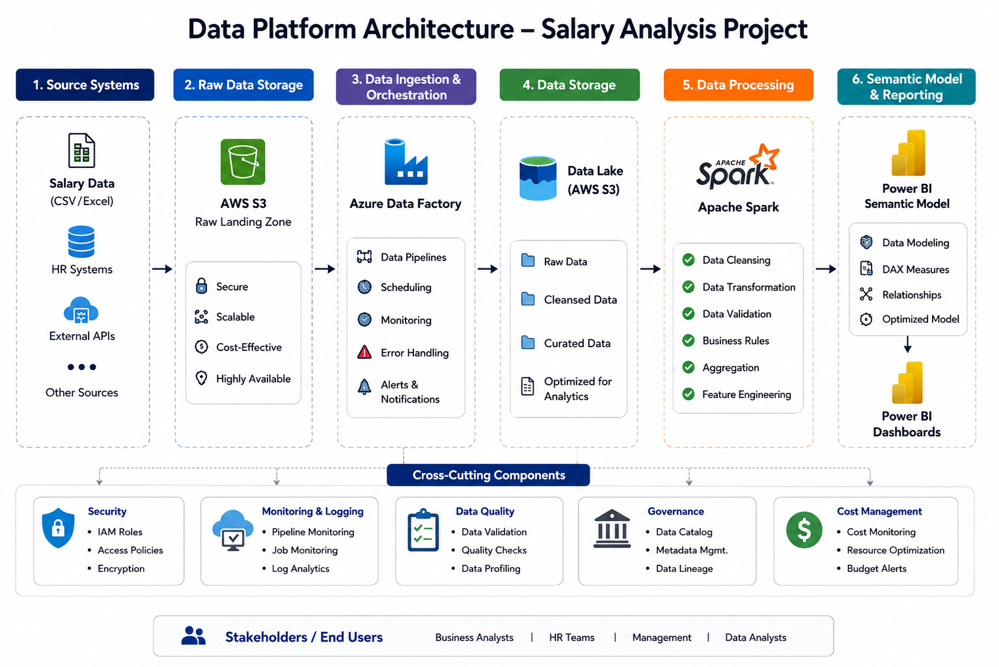

# 📊 Salary Analysis Data Engineering & Power BI Project

## Project Overview

This project demonstrates an end-to-end cloud analytics solution built using Azure Data Factory, AWS S3, Apache Spark, and Power BI.

The solution ingests raw salary data into AWS S3, orchestrates data movement and processing through Azure Data Factory, transforms and cleanses data using Apache Spark, stores curated datasets within a Data Lake architecture, and delivers actionable business insights through a Power BI Semantic Model and interactive dashboards.

This project showcases modern Data Engineering, ETL/ELT development, cloud storage, big data processing, and Business Intelligence reporting.
## 🏗️ Data Platform Architecture

