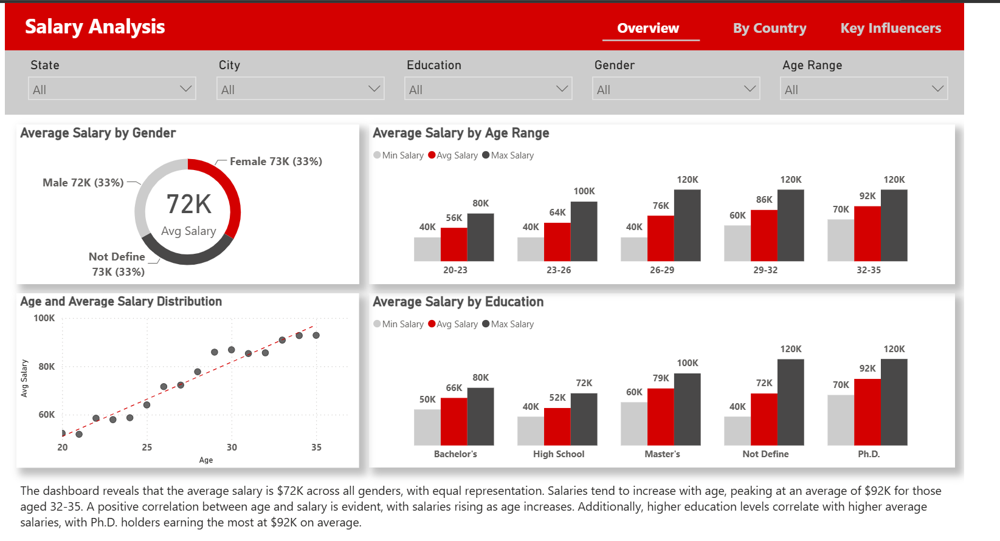
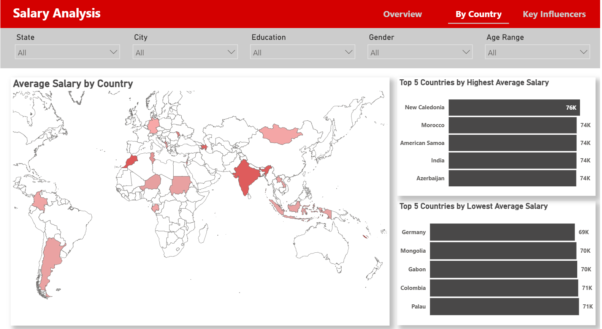

# 📊 Salary Analysis Data Engineering & Power BI Project

## Project Overview

This project demonstrates an end-to-end modern analytics platform built using Microsoft Fabric, AWS S3, Apache Spark, and Power BI.

The solution ingests salary data into AWS S3 as a raw landing zone, orchestrates data movement and pipeline execution using Microsoft Fabric Data Factory, stores and manages analytical datasets within Microsoft Fabric Lakehouse, performs data cleansing and transformation using Apache Spark, and delivers business insights through a Power BI Semantic Model and interactive dashboards.

The project showcases cloud-based data integration, data engineering, lakehouse architecture, semantic modeling, and business intelligence reporting.

---

## 🏗️ Data Platform Architecture

---

## Technology Stack

### Data Integration & Orchestration

* Microsoft Fabric Data Factory
* Data Pipelines
* Dataflows Gen2
* Workflow Automation
* Scheduled Refresh

### Cloud Storage

* AWS S3
* Raw Landing Zone
* Cloud Object Storage

### Data Storage & Management

* Microsoft Fabric Lakehouse
* Raw Data Storage
* Cleansed Data Storage
* Curated Data Storage

### Data Processing

* Apache Spark
* Python
* Data Validation
* Data Transformation
* Data Quality Management
* Feature Engineering

### Analytics & Reporting

* Power BI
* Power BI Semantic Model
* DAX
* Power Query

### Version Control

* Git
* GitHub

---

## Data Pipeline Workflow

### 1. Source Systems

Salary data is collected from multiple sources, including:

* CSV Files
* Excel Files
* HR Systems
* External APIs

### 2. Raw Data Storage

Raw datasets are stored in AWS S3, which serves as the landing zone for incoming files.

### 3. Data Ingestion & Orchestration

Microsoft Fabric Data Factory manages:

* Data Pipelines
* Dataflows Gen2
* Workflow Scheduling
* Monitoring
* Error Handling
* Alerting

### 4. Data Storage & Management

Data is stored within Microsoft Fabric Lakehouse and organized into:

* Raw Data
* Cleansed Data
* Curated Data

This structure supports efficient analytics and reporting workloads.

### 5. Data Processing

Apache Spark performs:

* Data Cleansing
* Data Transformation
* Data Validation
* Business Rule Implementation
* Aggregation
* Feature Engineering

### 6. Semantic Modeling & Reporting

The curated dataset is loaded into a Power BI Semantic Model, providing:

* Data Modeling
* DAX Measures
* Relationships
* Optimized Analytics Performance

Power BI dashboards deliver interactive reporting and business insights.

---

## 📊 Power BI Report Layout

### Overview Dashboard

Provides a high-level summary of salary trends and workforce demographics.

Features:

* Average Salary by Gender
* Average Salary by Age Range
* Salary Distribution by Age
* Average Salary by Education Level
* Interactive Filters

### Salary by Country

Provides geographical analysis of salary distribution across different countries and regions.

### Key Influencers

Uses Power BI AI visuals to identify factors that most influence salary outcomes.

---

## 📸 Dashboard Screenshots

### Overview Dashboard

### Salary by Country

### Key Influencers Analysis

---

## Key Business Insights

### Salary by Age

* Salary generally increases as age increases.
* Employees aged 32–35 demonstrate the highest average earnings.

### Salary by Education

* Higher educational attainment is associated with higher salaries.
* Ph.D. holders earn the highest average compensation.

### Salary Distribution

* A positive correlation exists between age and salary growth.
* Experience and education are key drivers of compensation.

---

## Skills Demonstrated

### Data Engineering

* Microsoft Fabric Data Factory
* Microsoft Fabric Lakehouse
* Apache Spark
* AWS S3
* ETL/ELT Development
* Data Quality Management
* Workflow Automation

### Business Intelligence

* Power BI Dashboard Development
* Semantic Modeling
* DAX Measures
* Data Storytelling
* Interactive Reporting

### Cloud Technologies

* Microsoft Fabric
* Amazon Web Services (AWS)
* Cloud Data Integration
* Lakehouse Architecture

---

## Author

**Alex Kaung**

Data Engineer | BI Developer | Data Analyst

GitHub: https://github.com/KaungAlex
